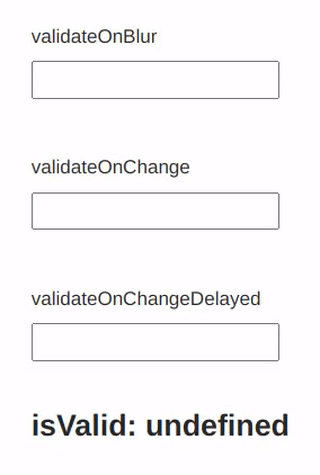

# Phone number validation tools

Phone number validation tools utilizing <a href="https://validatephonenumber.com">validatephonenumber.com</a> public API

## React phone input component

<a href="https://github.com/validate-phone/validate-phone-tools/tree/master/packages/react-input">https://github.com/validate-phone/validate-phone-tools/tree/master/packages/react-input</a>

- Minimalistic <2kB



```
npm i @validate-phone/react-input
```

## FormInput and Input component for <a href="https://ant.design/components/input/" rel="noopener noreferrer nofollow" target="_blank">antd</a>

<a href="https://github.com/validate-phone/validate-phone-tools/tree/master/packages/antd-input">https://github.com/validate-phone/validate-phone-tools/tree/master/packages/antd-input</a>

```
npm i @validate-phone/antd-input
```

## Fetch wrapper around validatephonenumber.com public API

<a href="https://github.com/validate-phone/validate-phone-tools/tree/master/packages/web">https://github.com/validate-phone/validate-phone-tools/tree/master/packages/web</a>

- <1kB
- Zero-dependency
- Compatible with all modern browsers

```
npm i @validate-phone/web
```

## Issues & Feedbacks

https://github.com/validate-phone/validate-phone-tools/issues
